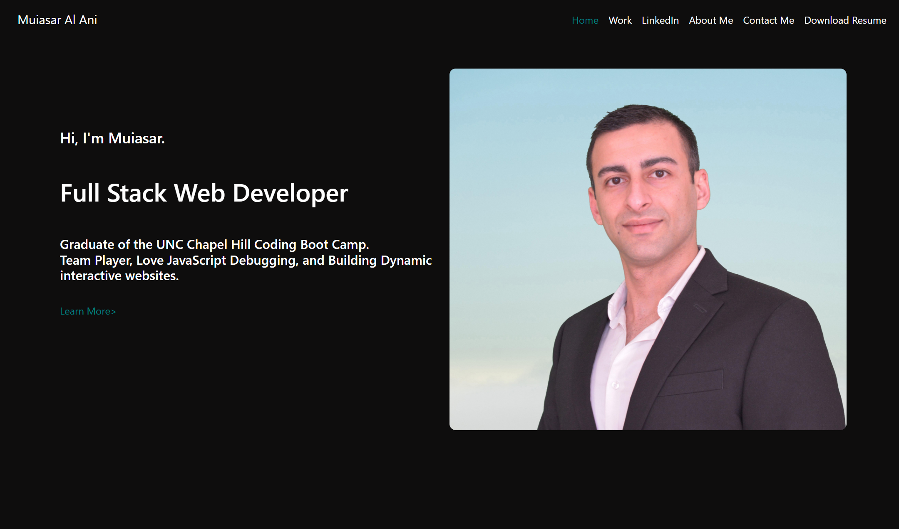
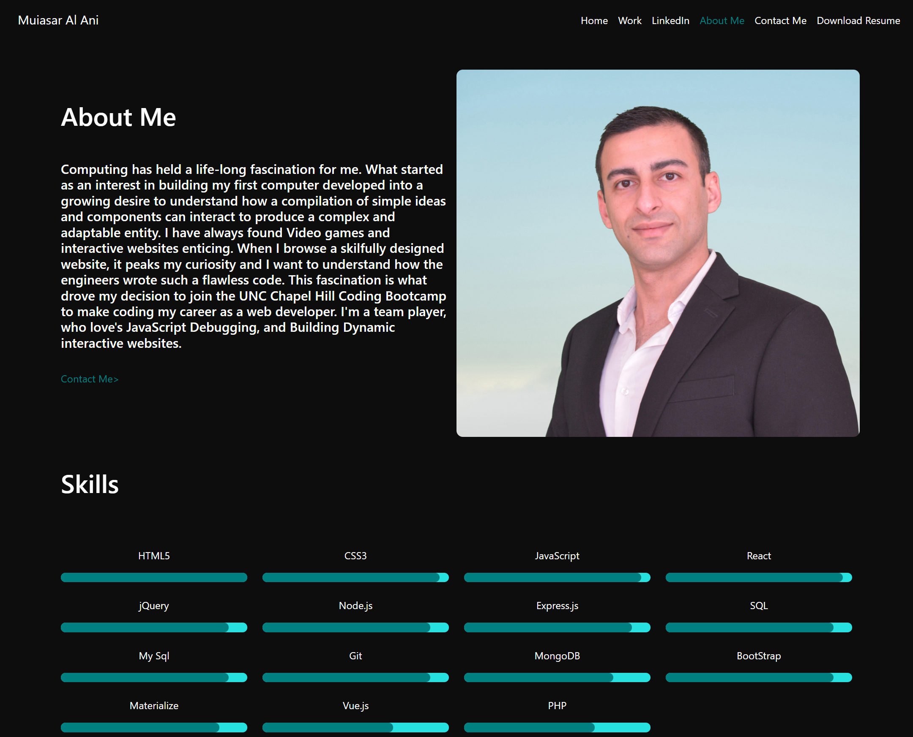
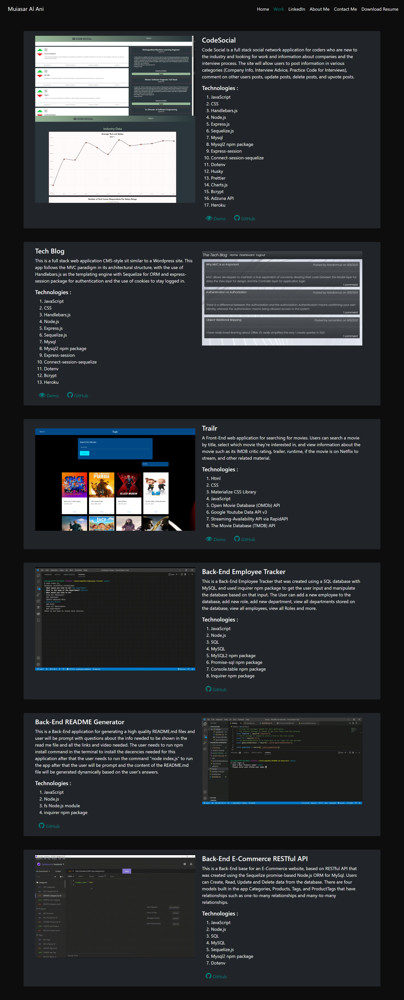
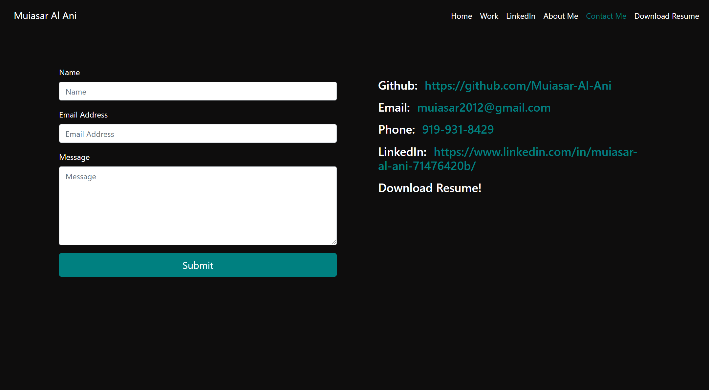

# Personal Portfolio

## Table of Contents

- [Description](#description-)
- [Licenses](#licenses-)
- [Installation](#installation-)
- [Technologies](#technologies-)
- [Screen shots](#screen-shots-)
- [Credits](#credits-)
- [Contributions](#contributions-)
- [Questions](#questions-)


## Description : 
This is my personal portfolio which I created using Bootstrap as my CSS framework and javascript. I also used GSAP 3 for animation and used the Formspree.io as my email client. 

## Licenses :
[](https://opensource.org/licenses/MIT)


## Installation :

To install the RWP App use the instructions bellow &#8595;

```
Mac:
open index.html

Windows:
start index.html

Linux:
xdg-open index.html
```

## Technologies : 

- HTML.
-  CSS.
-  BootStrap.
-  JavaScript.
-  GSAP 3.
-  Formspree Email Client.

## Screen shots : 
### Here are screen shots of my deployed Personal Portfolio App!


## Credits :

- [Muiasar-Al-Ani](https://github.com/Muiasar-Al-Ani)


## Contributions :
    Contributions, issues, and feature requests are welcome!
    Give a ⭐️ if you like this project!


## Questions : 
If you have any Question please feel free to contact me:
- muiasar2012@gmail.com
- [Muiasar-Al-Ani](https://github.com/Muiasar-Al-Ani)


&copy; 2021 [Muiasar-Al-Ani](https://github.com/Muiasar-Al-Ani)
